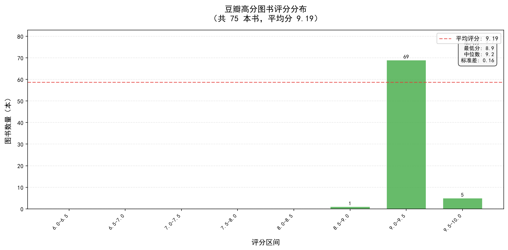

# 🕷️ 豆瓣公开高分图书榜单爬虫

> 一键抓取豆瓣高分图书榜单，自动完成数据清洗、Excel 导出、可视化制图的全流程爬虫系统。

---

## 📸 成果预览

### Excel 数据导出


*完整字段：书名、豆瓣链接、作者译者、出版社、出版日期、定价、豆瓣评分、评价人数*

### 评分分布可视化



*抓取到的高分图书评分主要集中在 9.0 ~ 9.5 区间*

---

## ✨ 功能特点

| 功能 | 说明 |
|------|------|
| 🔍 **多页爬取** | 默认抓取 3 页，可修改 `config.py` 中的 `CRAWL_PAGES` 调整 |
| 🧩 **8 字段采集** | 书名、豆瓣链接、作者译者、出版社、出版日期、定价、评分、评价人数 |
| 🧹 **智能清洗** | 自动去除脏数据、统一日期格式（YYYY-MM）、评分类型转换 |
| 📊 **可视化** | 自动生成评分分布柱状图 + Top 10 高分排行图 |
| 📋 **Excel 导出** | 自动列宽、冻结表头、格式美化 |
| 🛡️ **反爬策略** | UA 头伪装 + 1.5s 延时 + 异常重试 |
| 🏛️ **古籍适配** | 特殊处理校注类书籍字段拆分，杜绝校注人窜入出版社 |

---

## 📂 项目结构

```
豆瓣公开高分图书榜单/
├── main.py           # 主程序入口（一键运行全流程）
├── config.py         # 统一配置文件（所有参数集中管理）
├── spider.py         # 爬虫模块（HTTP 请求 + HTML 解析）
├── cleaner.py        # 数据清洗模块（去噪 + 格式化 + 过滤）
├── visualizer.py     # 可视化模块（matplotlib 绑图）
├── requirements.txt  # 依赖清单
├── book_data.xlsx    # 输出：清洗后的图书数据表
├── score_dist.png    # 输出：评分分布柱状图
├── top_books.png     # 输出：Top 10 高分图书排行图
└── README.md         # 本文件
```

---

## 🚀 快速开始

### 1. 克隆项目

```bash
git clone https://github.com/你的用户名/douban_book_spider.git
cd douban_book_spider
```

### 2. 安装依赖

```bash
pip install -r requirements.txt
```

### 3. 运行

```bash
python main.py
```

运行后自动完成四个步骤：

```
第一步 → 爬虫抓取（3页 × 每页25本 = 75条）
第二步 → 数据清洗（去噪、格式化、类型转换）
第三步 → 导出 Excel（book_data.xlsx）
第四步 → 生成图表（score_dist.png + top_books.png）
```

---

## ⚙️ 配置说明

所有可调参数集中在 `config.py` 中，按需修改即可：

```python
# 爬取页数（每页约25本图书）
CRAWL_PAGES = 3

# 请求间隔（秒），避免被豆瓣限流
REQUEST_DELAY = 1.5

# 目标豆列链接
BASE_URL = "https://www.douban.com/doulist/1263997/"

# 输出文件名
OUTPUT_EXCEL = "book_data.xlsx"
```

---

## 🛠️ 技术栈

- **Python 3.8+**
- `requests` — HTTP 请求
- `BeautifulSoup4` — HTML 解析
- `pandas` — 数据处理与 Excel 导出
- `matplotlib` — 数据可视化
- `openpyxl` — Excel 底层引擎

---

## 📊 示例数据

| 书名 | 作者译者 | 出版社 | 出版日期 | 豆瓣评分 |
|------|----------|--------|----------|----------|
| 红楼梦 | 曹雪芹 / 高鹗 | 人民文学出版社 | 1996-12 | 9.6 |
| 百年孤独 | [哥伦比亚] 加西亚·马尔克斯 | 南海出版公司 | 2011-06 | 9.2 |
| 说文解字 | [汉] 许慎 撰 / [宋] 徐铉杨 校定 | 中华书局 | 1963-12 | 9.2 |

---

## 📝 许可

MIT License — 完全开源，可用于个人/商业用途。

---

## 👤 作者

如果你对这个项目感兴趣，欢迎 Star ⭐ 或提 Issue！

GitHub：[你的用户名](https://github.com/你的用户名)
